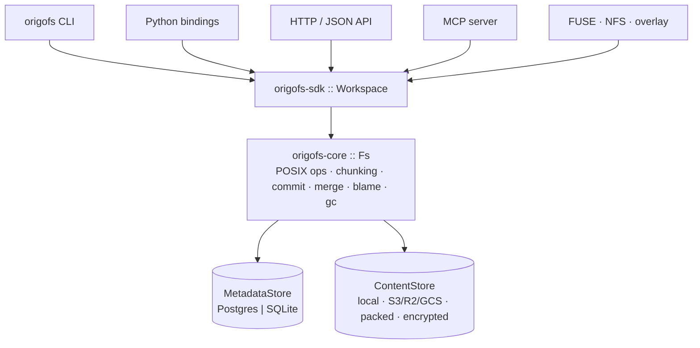

> [!WARNING]
> **This is vibe-coded software.** origofs was built largely by AI agents and has
> only been **partially reviewed** by a human. Treat it as an experiment, not as
> production software: read the code before you run it, expect rough edges and
> breaking changes, and don't point it at data you can't afford to lose.

<div align="center">

# origofs

**A filesystem where humans and AI agents share the same files —
and every byte knows who wrote it.**

[](https://github.com/danplischke/origofs/actions/workflows/ci.yml)
[](LICENSE)
[](#install)
[](https://codecov.io/gh/danplischke/origofs)
[](docs/DESIGN.md)

[**Quickstart**](#quickstart) · [**Agents**](#working-with-agents) ·
[**Attribution**](#know-who-did-what) · [**Retrieval**](#retrieval-that-carries-provenance) ·
[**Versioning**](#versioning) · [**Teams**](#running-for-a-team) ·
[**Mounts**](#mount-it-as-a-real-filesystem) · [**Python**](#python) ·
[**CLI**](#cli-reference) · [**Design**](docs/DESIGN.md)

</div>

---

Point an agent at your files and let it work. Then ask what it did — not the
chat log, not a diff you hope is complete. Ask the **filesystem**:

```bash
origofs --workspace ./ws init
AGENT=$(origofs --workspace ./ws actor claude --agent --model claude-opus-4-8)

# the agent edits in a fast native mount; every change streams into origofs, attributed, live
origofs --workspace ./ws overlay --actor "$AGENT" -- claude -p "refactor the parser"

# who wrote which lines?
origofs --workspace ./ws blame /src/parser.rs
```

```text
   1-40    human:dan
  41-58    agent:claude      ← the agent's work, down to the line
  59-72    human:dan
```

Don't like the result? `ws.revert_session(agent, session)` undoes **everything
that agent did in that session** — across every file it touched — and leaves the
human edits standing.

origofs is content-addressed storage with a real metadata database (Postgres or
SQLite), opt-in Git-style versioning, and per-actor attribution recorded in the
write path itself. It isn't a wrapper over `git` or a VFS shim — it's a storage
engine, exposed through a CLI, a Rust SDK, Python bindings, an HTTP API, MCP, and
real filesystem mounts (FUSE/NFS).

> **Pre-1.0 and moving fast.** Build from source ([Install](#install)); the
> `overlay` and `sandbox` commands need Linux (unprivileged overlayfs).

## Why origofs

Six questions a directory of files can't answer:

|  |  |
|---|---|
| **Who wrote this line — a person or an agent?** | Every attributed write records the actor, session, and tool-call behind it. `origofs blame` reports it per line; the record survives commits, branch switches, and reformatting. |
| **Can I undo just the agent's work?** | Revert an agent's entire session across every file it touched, keeping everyone else's edits intact. |
| **Can I review before it lands?** | Agents can *propose* edits into a review queue instead of applying them; a human accepts (credited to the agent) or rejects. An actor can even be made *propose-only*, so its writes are gated into that queue automatically. |
| **Can people and agents edit together, live?** | Opt-in CRDT co-editing lets humans, agents, and browser editors type into the same document at once and converge — with every character still attributed to whoever wrote it. |
| **Will it hold up for a team?** | The Postgres backend is built for many concurrent writers — humans and agents — sharing one workspace, with a live change feed and presence so every client sees edits as they happen. |
| **Can I trust what I read back?** | Content is BLAKE3-addressed and verified on every read: silent bit-rot or tampering in object storage surfaces as an error instead of being served as if it were real. |

## How it fits together

One idea holds the whole system up: **the names and the bytes are stored
separately, and never mixed.** The metadata store holds inodes, dentries, refs,
blame, and the change feed — content only ever by hash. The content store holds
the bytes, as content-defined chunks and immutable git-style objects. Every
surface funnels down to the same engine, so behaviour is identical whichever one
you drive:



The mutable working tree is an **overlay whose base is a commit tree** — git's
index idea, made the storage model. Reads fall through the working tree to the
base tree to chunks; writes copy up; committing crystallizes the working tree into
new immutable objects. [`docs/DESIGN.md`](docs/DESIGN.md) §3 is the long version.

## Install

Not published to crates.io or PyPI yet, so build from source. **Rust 1.88+** —
edition 2024 sets a 1.85 language floor, but let-chains and the dependency graph
raise the real minimum, and CI pins it.

```bash
cargo install --path crates/origofs-cli   # installs `origofs` AND `git-remote-origofs`
# or, without installing:
cargo build --release                     # ./target/release/origofs
```

Both binaries come from that one install — `git` finds `git-remote-origofs` off your
`PATH` to make `git clone origofs://…` work.

In a container instead — see [Deployment](#deployment) for the full
Postgres + object-storage stack:

```bash
docker build -t origofs .
docker run --rm -p 8080:8080 -v "$PWD/ws:/var/lib/origofs/ws" origofs \
    serve --addr 0.0.0.0:8080 --auth-token "$TOKEN=$ACTOR"
```

The Python bindings build with maturin, not cargo:

```bash
cd crates/origofs-py
python -m venv .venv && . .venv/bin/activate
pip install maturin && maturin develop
```

A workspace is just a directory origofs manages (metadata DB + content store). For a
team deployment, point it at Postgres and object storage instead — see
[Running for a team](#running-for-a-team) and [Storage backends](#storage-backends).

## Quickstart

```bash
WS=./ws
origofs --workspace "$WS" init
echo 'hello from origofs' | origofs --workspace "$WS" write /notes/a.txt
origofs --workspace "$WS" ls   /notes
origofs --workspace "$WS" read /notes/a.txt
origofs --workspace "$WS" stat /notes/a.txt

# the same write, attributed — this is the one blame can read back
DAN=$(origofs --workspace "$WS" actor dan)
echo 'hello from dan' | origofs --workspace "$WS" write /notes/a.txt --actor "$DAN"
origofs --workspace "$WS" blame /notes/a.txt
```

Writes without `--actor` are *unattributed*: they store content but record no
authorship, and they invalidate any blame the file had. Attribution is opt-in per
write on the CLI, and automatic on the agent-facing surfaces below.

From Rust:

```rust
use origofs_sdk::Workspace;

let ws = Workspace::open_local("meta.db", "cas").await?;   // or open_pg(dsn, cas)
ws.mkdir_p("/notes").await?;
ws.write("/notes/a.txt", b"hello").await?;
let bytes = ws.read("/notes/a.txt").await?;
```

## Working with agents

### A native mount agents edit in place

The fastest way to put an agent to work is a **live overlay mount**. origofs sets up
an unprivileged kernel overlay over the workspace, runs your agent inside it, and
streams the agent's changes back into origofs — *attributed, as they happen*, not
only when the process exits:

```bash
origofs --workspace "$WS" overlay --actor "$AGENT" --sync-ms 500 -- \
    some-agent --do-the-thing
```

The agent sees an ordinary directory and reads/writes at native speed; origofs
captures each change (create, modify, delete) into the content store and records
it against `--actor`. When it finishes, `origofs blame` and the change feed already
reflect everything it did. This is how agents are meant to interact with origofs day
to day.

> [!CAUTION]
> **`overlay` and `sandbox` are edit capture, not a security boundary — by
> default.** The command runs with *your* privileges over a plain copy-on-write
> overlay: the whole host filesystem stays reachable, including this workspace's
> own `meta.db`/`cas` and your credentials. There is no network namespace and no
> seccomp; origofs only strips `ORIGOFS_ENCRYPTION_KEY` from the child's environment.
> Run only code you trust.
>
> Pass **`--isolate`** to run the command under bubblewrap in a fresh tmpfs root
> that hides the host filesystem — a real boundary for untrusted code (needs
> `bwrap` ≥ 0.8.0). It is deliberately *filesystem-only*: the network namespace is
> left shared on purpose, because agents need egress, so it does not by itself
> contain network-reachable resources. Either way the delta is captured and
> imported identically.

### Capture on exit instead of live

`origofs sandbox` is the batch counterpart: run a command over a copy-on-write view
of the workspace and import the whole delta when it exits — or throw it away.

```bash
origofs --workspace "$WS" sandbox --actor "$AGENT" --isolate -- ./refactor.sh
origofs --workspace "$WS" sandbox --actor "$AGENT" --discard -- ./try-something.sh
```

Prefer a protocol integration? origofs also speaks **MCP** (Model Context Protocol)
over stdio, so an agent can call filesystem tools directly — and every write is
attributed to the agent:

```bash
origofs --workspace "$WS" mcp --agent-name claude --model claude-opus-4-8
```

Wire it into a client the usual way:

```json
{
  "mcpServers": {
    "origofs": {
      "command": "origofs",
      "args": ["--workspace", "/path/to/ws", "mcp",
               "--agent-name", "claude", "--model", "claude-opus-4-8"]
    }
  }
}
```

Logs go to stderr, so stdout stays clean for the JSON-RPC transport.

### Propose-and-review, not just apply

An agent can submit an edit for human review instead of applying it. The proposed
bytes go straight into the content store (deduplicated, diffable); the working
tree doesn't change until someone accepts:

```bash
echo "patched" | origofs --workspace "$WS" suggest /main.rs --actor "$AGENT" --summary "fix bug"
origofs --workspace "$WS" suggestions --status pending
origofs --workspace "$WS" suggestion-diff 1              # base → proposed, unified diff
origofs --workspace "$WS" accept 1 --actor "$HUMAN"      # applies it, credited to the agent
```

`accept` lands the edit **attributed to the authoring agent** (so blame stays
honest) and records the approver; it refuses if the file moved since the proposal
(a stale base). `reject` discards it.

The queue is **actor-agnostic** — it's a change-request workflow between people
just as much as an agent-proposal one. Whether an actor *must* propose (rather
than write directly) is its **write policy**: a bounded trust gate that's a
property of the actor, not its kind. A trusted agent stays `direct`; an untrusted
contributor is set `propose`-only and every write it makes — on *any* surface — is
routed into the review queue instead of landing:

```bash
origofs --workspace "$WS" write-policy "$AGENT" propose   # now its writes must be reviewed
```

Over **MCP**, an agent gets the whole loop as tools — `origofs_read`,
`origofs_write`, `origofs_edit` (exact string search-and-replace), `origofs_suggest`,
`origofs_suggestion_diff`, `origofs_accept`, `origofs_reject` — under the same
server-side attribution and policy enforcement (and it can't accept its own
proposals).

## Know who did what

Every attributed write (`write_as`) records an append-only edit-op — actor,
session, tool-call, before/after content — and updates a per-line authorship map.
`origofs blame` then reports, per line range, whether a **human** or an **agent** wrote
it:

```bash
origofs --workspace "$WS" blame /src/parser.rs
#    1-40   human:dan
#   41-58   agent:claude
#   59-72   human:dan
```

Blame is keyed by **content**, so it stays correct where naïve line-tracking
breaks: it survives commits and branch checkouts (the map travels with the bytes,
never desyncing from the file), a re-indent or a moved block keeps its original
author rather than being credited to whoever reformatted, and content produced
outside the attributed path simply blames to nothing instead of showing stale
authorship.

Undo an agent's work without touching anyone else's — `revert_session` walks
every file the agent touched in that session and removes exactly the lines it
authored, leaving surrounding human edits in place:

```rust
let files_changed = ws.revert_session(agent_id, session_id).await?;
```

## Retrieval that carries provenance

Indexing an origofs workspace isn't "object storage plus embeddings". `passages`
extracts retrieval units from the working tree, and every one carries **who wrote
it** and a content hash — so an answer can cite its authors, and re-indexing only
touches the passages whose bytes actually changed:

```rust
use origofs_core::{PassageOptions, Segmentation};

let passages = ws.passages(&PassageOptions {
    root: "/docs".into(),
    exts: Some(vec!["md".into()]),
    ..Default::default()          // content-defined segmentation, text + blame on
}).await?;

for p in &passages {
    // p.path · p.byte_start..p.byte_end · p.hash · p.text · p.blame
}
```

The default `Segmentation::ContentDefined` is the one that pays off over time:
boundaries are chosen by the local bytes (FastCDC), so an edit only disturbs the
passage it lands in and every other passage keeps its hash — and therefore its
embedding. Fixed-size windows re-hash the whole tail of a file on any insert.
`with_text: false` gives a cheap manifest pass (paths + hashes only) for diffing
two revisions before you spend anything on embeddings.

There are no embeddings, vector store, or framework in here — that half is
deliberately yours. From Python, `origofs.rag` returns the same records and
`origofs.llamaindex.SimpleWorkspaceReader` hands them to LlamaIndex as one
`Document` per passage with the provenance in metadata.

## Versioning

Versioning is opt-in and Git-shaped — a real commit DAG, branches, checkout, log,
status, three-way merge, and locks — but backed by origofs's content-addressed store,
so snapshots are incremental (only changed chunks are stored) and identical trees
are shared across commits for free.

```bash
origofs --workspace "$WS" commit -m "initial" --author "Dan <dan@example.com>"
origofs --workspace "$WS" branch feature
origofs --workspace "$WS" checkout feature
origofs --workspace "$WS" diff main feature                # changed-path list
origofs --workspace "$WS" diff main feature --path /x.rs   # one file's line diff
```

Branch comparison works on content addresses, not file reads: equal hashes mean
an identical file (a 32-byte compare), so a diff only ever reads the paths that
actually changed — the metadata trees *are* the index.

### Real-`git` interop

origofs stays BLAKE3-native internally, but its history projects to — and imports
from — genuine git objects, so you can keep using the `git` CLI and hosts like
GitHub:

```bash
# origofs history → a real git repo the `git` binary reads directly
origofs --workspace "$WS" git export ./repo --format sha256   # or sha1 for GitHub
git -C ./repo log --oneline
git -C ./repo fsck --strict                                # clean

# a real git repo → origofs history
origofs --workspace "$WS2" git import ./repo --branch main
```

With `git-remote-origofs` on your `PATH`, the real `git` can even clone, fetch, and
push an origofs workspace over `origofs://` URLs — no export step:

```bash
git clone origofs://"$WS" checkout
cd checkout && echo hi >> readme.md && git commit -am edit && git push origin main
```

Large files can be exported as git-LFS pointer blobs (`--lfs-threshold <bytes>`),
backed by origofs's chunk store.

## Running for a team

For a shared human+agent workspace, run origofs on **Postgres** — the backend built
for many concurrent writers. Atomic-create is serialized so racing writers never
leave orphaned inodes, and the whole write path is transactional: content is made
durable first, then metadata, blame, and the audit log commit together, so a
crash can never leave a half-recorded edit.

```rust
let ws = Workspace::open_pg("host=db port=5432 user=origofs dbname=origofs", content).await?;
```

### Many workspaces in one store

A single store can hold many workspaces. Each gets its own root, refs, and working
tree; they share the content store and the identity tables (actors, blame, audit),
and are separated by a `workspace_id`:

```rust
let team = ws.workspace("team-alpha").await?;   // created on first use
let all  = ws.workspaces().await?;              // ["default", "team-alpha", …]
```

The metadata pool, content store, and Postgres push-feed handle are all shared
with the parent, so opening one is cheap — and `subscribe` on it tails only that
workspace's slice of the change feed. This is the first step of the tenancy model;
the full picture (control plane vs. data plane, isolation levels, the
`TenantRouter`) is written up in
[`docs/MULTI_TENANCY.md`](docs/MULTI_TENANCY.md).

### Live collaboration

Every operation lands on an append-only **change feed** (who touched what, who
committed), and each session heartbeats its **presence** (which actor, which
path). Tail the feed by cursor, or — on Postgres — let `LISTEN/NOTIFY` push new
events so clients never poll:

```bash
origofs --workspace "$WS" watch --follow    # live feed: seq  kind  actor  path
origofs --workspace "$WS" presence          # who's active right now
```

The feed is **exactly-once and in commit order** even under concurrent writers,
and every event is **branch-scoped**, so a UI showing `main` filters to one
branch. From Rust, `PostgresMetadataStore::subscribe(after_seq, branch)` returns
a blocking `LISTEN`-backed subscription whose `recv()` wakes on every committed
change — a real push, not a poll.

### Live co-editing (CRDT)

Opt-in (the `coedit` feature): humans, agents, and browser editors type into the
same document **concurrently** and converge — a CRDT (`yrs`) under the hood, with
authorship tracked per character. It speaks the standard Yjs **y-sync** protocol,
so an unmodified Yjs client connects to the co-editing WebSocket with no custom
server code — a plain-text or Markdown editor bound to the shared text (over
`y-websocket`) collaborates out of the box. The shared document is a flat-text
CRDT, so a *structural* rich-text editor such as PlateJS shapes its Yjs document
to match rather than binding the flat text directly.

The server stays the sole authority on **who wrote what**: whatever a client's
bytes claim, each inserted run is attributed to the *authenticated* actor. When a
session checkpoints, that character-level, interleaved authorship lands in the
*same* byte-range blame index as ordinary writes — so two people editing one line
show up as two spans, not one collapsed line.

```rust
let doc = ws.open_coedit(ctx, "/notes.md").await?;    // resume the live CRDT
// … clients exchange y-sync updates over the WebSocket …
ws.checkpoint_coedit(ctx, "/notes.md", &doc).await?;  // crystallize into blame
```

Across workers it stays consistent: when a document is edited on two processes at
once (behind a load balancer), a Postgres `LISTEN/NOTIFY` relay fans each update
out so every worker's replica converges. The co-editing endpoint is served as a
WebSocket at `GET /coedit/{path}` by both the HTTP API and the FastAPI router.

### HTTP API

Every operation is available over HTTP/JSON — files as raw bytes, everything else
as JSON — so any client or service can drive a workspace. Writes go through the
same path as every other surface, so they land on the change feed and carry
attribution:

```bash
origofs --workspace "$WS" serve --addr 127.0.0.1:8080 --auth-token "$TOKEN=$ACTOR" &
AUTH=(-H "Authorization: Bearer $TOKEN")

curl "${AUTH[@]}" -X PUT --data-binary 'hello' http://127.0.0.1:8080/v1/files/notes/a.txt
curl 'http://127.0.0.1:8080/v1/files/notes/a.txt'                    # → hello
curl "${AUTH[@]}" -X POST -d '{"message":"first"}' http://127.0.0.1:8080/v1/commit
curl 'http://127.0.0.1:8080/v1/events?since=0'                       # the change feed
curl 'http://127.0.0.1:8080/readyz'                                  # backends reachable?
```

The data surface is versioned under **`/v1`**; liveness (`/health`) and readiness
(`/readyz`) stay at the root so an orchestrator probes them independent of the API
version. Full routes cover files, dirs, stat, blame, rename, commit/log,
branches/checkout, events, presence, actors, sessions, diff, suggestions, and the
live co-editing WebSocket.

**Attribution never comes from the request.** A write is attributed to the actor
the *credential* resolves to — the request never names an actor, so a client can't
forge blame, and a propose-only actor's `PUT` is routed into the review queue
instead of landing. `--auth-token TOKEN=ACTOR[:SESSION]` is the built-in bearer
mapping; `serve` refuses to bind a non-loopback address without one. Errors come
back as a machine-readable envelope (`{"error":{"code","message","retryable"}}`)
and every response carries an `x-request-id`.

### Deployment

`docker-compose.yml` brings up the production-shaped stack — the HTTP API over a
Postgres metadata store and a MinIO (S3) content store:

```bash
docker compose up --build
curl localhost:8080/readyz
curl -H 'Authorization: Bearer demo-token' \
     -X PUT --data-binary 'hello' localhost:8080/v1/files/notes/a.txt
```

For your own deployment, a config file selects the backends for the shipped
daemons (`serve`, `nfs`, `mcp`, `mount`) with no custom host program — full
options in [`deploy/config.example.toml`](deploy/config.example.toml):

```toml
[metadata]
backend = "postgres"                 # or "sqlite"
dsn = "host=postgres user=origofs dbname=origofs"

[content]
backend = "s3"                       # or "gcs" / "local"
bucket  = "origofs-content"
region  = "us-east-1"
packed  = true                       # batch chunks into pack objects
```

```bash
origofs --config ./origofs.toml --workspace /var/lib/origofs/ws \
    serve --addr 0.0.0.0:8080 --auth-token "$TOKEN=$ACTOR"
```

One caveat worth planning around: the **packed** layout keeps a local per-chunk
index, so a multi-container deployment needs that index on a shared volume (or a
single writer). The unpacked S3 layout keeps every writer's state in the bucket
plus the database, which is why the compose file uses it.

### Observability

The libraries are **emit-only**: `origofs-core` and `origofs-sdk` emit `tracing` spans
and events but install no subscriber, so embedding origofs in your own binary costs
nothing and you install your own. The CLI installs one:

```bash
ORIGOFS_LOG=debug origofs --log-format json --workspace "$WS" serve --addr 127.0.0.1:8080
```

Level filter comes from `ORIGOFS_LOG` (falling back to `RUST_LOG`, default `info`),
and output always goes to **stderr** so `origofs mcp` keeps stdout for JSON-RPC.
Backend errors carry a stable machine `code()` plus `retryable()`/`class()` instead
of a flat string, which is what the HTTP error envelope surfaces. `/health` is
liveness; `/readyz` is a real readiness probe that pings both stores.

## Mount it as a real filesystem

Any program that can open a file can use an origofs workspace — no client library:

```bash
# FUSE (Linux; needs root and /dev/fuse). Blocks until unmounted.
sudo origofs --workspace "$WS" mount /mnt/origofs

# NFSv3 — the portable path, and how macOS mounts a workspace. Blocks until stopped.
origofs --workspace "$WS" nfs --addr 127.0.0.1:11111
sudo mount -o vers=3,tcp,port=11111 127.0.0.1:/ /mnt/origofs
```

Both go through the same engine as every other surface, so a write through the
mount lands on the change feed and in the audit log like any other. But plain
POSIX writes carry no identity — they are **unattributed**, and they invalidate
the file's existing blame rather than inventing an author for it. When you want
authorship, drive an attributed surface: the overlay mount, MCP, the HTTP API, or
the SDK.

## Built to not lose or corrupt data

Because agents can generate a lot of churn against shared storage, correctness
under failure is a first-class concern:

- **Corruption never passes as real.** Content is BLAKE3-addressed and re-hashed
  on read against the address it was fetched by. A flipped bit, a truncated
  object, or tampering in object storage surfaces as a precise error — down to the
  offending chunk — instead of being handed back as authentic. Compaction
  re-verifies every surviving chunk before dropping the old copy.
- **Writes are atomic and durable.** Content is flushed before the metadata that
  references it commits, and an edit's inode, content, blame, and audit entry all
  land in one transaction — or none of them do.
- **Blame can't lie.** Authorship is tied to content, so it can never drift out
  of sync with the file it annotates (see [Know who did what](#know-who-did-what)).
- **The bucket can rebuild the database.** Content is stored as a self-describing
  git-style graph (commit → tree → file manifest → chunks), and the branch table
  is mirrored alongside it, so if the metadata DB is lost you can point a fresh one
  at the surviving object store and `origofs fsck --rebuild` to recover every committed
  file, directory, and branch — chunking and all. (Blame and the audit log live
  only in the DB, so back that up — Postgres PITR or SQLite replication.)

## Storage backends

Content addressing means a chunk's identity is its BLAKE3 hash, so dedup,
versioning, and integrity hold no matter where bytes live.

- **Local** — a sharded content-addressed directory. `Workspace::open_local`.
- **Object storage** — Content-defined chunking keeps edits cheap (only changed
  chunks re-upload), and a **pack layer** (`open_s3_packed` / `open_gcs_packed`)
  batches chunks into large pack objects so you make a few big PUTs instead of
  thousands of tiny ones, with a small local index for single ranged-GET reads.
  `repack()` reclaims space from deleted chunks. Two flavours:
  - **S3 / R2 / MinIO** (and GCS via its S3-interop API with HMAC keys) —
    `Workspace::open_s3`.
  - **Google Cloud Storage, natively** — `Workspace::open_gcs`, over GCS's JSON
    API with OAuth2: a service-account key/file, Application Default Credentials
    (`GOOGLE_APPLICATION_CREDENTIALS` / `gcloud`), or GKE workload identity — no
    HMAC keys needed.
- **Encryption at rest** — wrap any backend so content is encrypted
  (XChaCha20-Poly1305) before it touches disk or the network, transparently to
  the engine. The address stays the plaintext hash, so **dedup still works**
  (convergent encryption). Set `ORIGOFS_ENCRYPTION_KEY` or use
  `Workspace::open_local_encrypted`.

Content is addressed and never overwritten, so churn leaves orphaned chunks
behind; mark-and-sweep garbage collection reclaims them:

```bash
origofs --workspace "$WS" gc     # run when idle — not safe alongside active writers
```

## Interfaces

| Surface | Use it for |
|---|---|
| **`origofs` CLI** | Scripting and day-to-day workspace operations |
| **Rust SDK** (`origofs-sdk`) | Embedding origofs in a Rust service |
| **Python** (`origofs-py`) | Async-native PyO3 bindings — FastAPI-ready, resolve identity yourself |
| **HTTP API** (`origofs-sdk` `api` feature) | Any language / any client over JSON |
| **MCP** (`origofs-sdk` `mcp` feature) | Agents calling filesystem tools directly, attributed |
| **Overlay mount** | Running an agent live in a fast native mount |
| **Sandbox** (`sandbox` feature) | Running a command over a copy-on-write view and importing its delta |
| **FUSE / NFS** (`fuse`/`nfs`) | Mounting the workspace as a POSIX filesystem |
| **`git-remote-origofs`** (`git` feature) | Driving a workspace with the real `git` over `origofs://` |
| **Co-editing WebSocket** (`coedit`) | Yjs clients typing into a shared document, attributed |

The six access surfaces after the CLI and SDK are **feature-gated modules of
`origofs-sdk`**, all default-off; `full` turns them on (`coedit` stays separate), and
that is what `origofs-cli` builds with. A plain `origofs-sdk` dependency stays lean.

### Python

Every I/O method is awaitable, so the bindings drop straight into `async def`
handlers, and you inject the identity behind each write:

```python
import origofs
ws  = await origofs.Workspace.open_local("meta.db", "cas")   # or open_pg(dsn, cas)
actor = await ws.find_or_create_human("user_42", "Dan")      # your id -> an origofs actor
ctx = origofs.WriteCtx.session(actor, session_id)            # your resolved identity
await ws.write_as(ctx, "/notes.txt", b"hello")               # attributed -> blame + audit
```

That's the base. Four integrations sit on top, each behind its own extra:

- **FastAPI router** — `origofs.fastapi.build_router(ws, authn=...)` gives you every
  workspace endpoint with attribution driven by an auth dependency *you* provide.
  origofs ships no authentication on purpose: a blame trail is only as trustworthy as
  the identity behind each write, so resolving it is yours to own. Mutating routes
  depend on `authn` and the request body never names an actor.
- **fsspec** — `origofs.fsspec.OrigoFileSystem` registers the `origofs://` protocol, so
  pandas, Dask, PyArrow, and Zarr read and write workspace paths directly. It is a
  genuine `AsyncFileSystem` (usable sync *or* awaited), passes fsspec's own
  conformance suite, and carries attribution: pass `actor=`/`session=` and
  `fs.blame(path)` credits the write.
- **universal-pathlib** — `UPath("origofs:///notes.txt", db_path=..., cas_dir=...)`
  works as a first-class registered protocol, so `read_text`/`iterdir`/`stat`
  behave like `pathlib`.
- **`origofs.db`** — SQLAlchemy models plus Alembic migrations for the metadata
  schema, for when you want to query actors, edit-ops, and blame with the rest of
  your app's SQL.

Full detail, including the RAG/LlamaIndex reader and overlay orchestration, is in
[`crates/origofs-py/README.md`](crates/origofs-py/README.md).

## CLI reference

`origofs --help` is authoritative; this is the map. Global flags: `--workspace <dir>`
(required), `--config <file>` to select backends, `--log-format text|json`.

| Area | Commands |
|---|---|
| **Files** | `init` · `ls` · `read` · `write` · `stat` · `mkdir` · `rm` · `mv` |
| **Attribution** | `actor` · `blame` · `write-policy` |
| **Review queue** | `suggest` · `suggestions` · `suggestion-diff` · `accept` · `reject` |
| **Versioning** | `commit` · `log` · `status` · `diff` · `branch` · `checkout` · `merge` · `conflicts` |
| **Locks** | `lock` · `unlock` · `locks` |
| **Git interop** | `git export` · `git import` (plus the `git-remote-origofs` helper) |
| **Agents** | `overlay` · `sandbox` · `mcp` |
| **Serving & mounts** | `serve` · `nfs` · `mount` |
| **Live** | `watch` · `presence` |
| **Maintenance** | `gc` · `fsck [--rebuild]` |

## Configuration

| Variable | Used by | What it does |
|---|---|---|
| `ORIGOFS_ENCRYPTION_KEY` | any surface | Opts the workspace into encryption at rest, kept out of argv and shell history. The **same** value must be used on every open or reads fail loudly. |
| `ORIGOFS_LOG` | CLI | Tracing filter (falls back to `RUST_LOG`; default `info`). |
| `RUST_LOG` | CLI | Fallback tracing filter. |
| `ORIGOFS_DATABASE_URL` | `origofs.db` (Python) | Target for the Alembic migration runner. |
| `GOOGLE_APPLICATION_CREDENTIALS` | GCS backend | Application Default Credentials for the native GCS store. |
| `ORIGOFS_PG_TEST_URL` | tests | Postgres-backed tests self-skip unless this points at a reachable database. |
| `ORIGOFS_S3_TEST_*` / `ORIGOFS_GCS_TEST_*` | tests | Credentials for the real object-store suites. |

Backend selection itself lives in the `--config` TOML — see
[Deployment](#deployment).

## Platform support

| | Linux | macOS | Windows |
|---|:---:|:---:|:---:|
| Engine, CLI, SDK, HTTP API, MCP, Python | ✅ | ✅ | untested |
| FUSE mount | ✅ | — | — |
| NFSv3 | ✅ | ✅ | — |
| `overlay` / `sandbox` | ✅ | — | — |
| `--isolate` (bubblewrap) | ✅ | — | — |

FUSE and NFS are `cfg(unix)`. NFSv3 is how a workspace gets mounted on macOS.
`overlay`/`sandbox` need unprivileged overlayfs in a user namespace, which is
Linux-only. CI runs Linux and macOS; nothing is claimed for Windows because
nothing tests it.

## If you're coming from…

| | Where origofs differs |
|---|---|
| **`git` (+ git-LFS)** | The working tree is live and shared, not something you stage and commit; authorship is recorded *at write time* per byte range, by actor and session, rather than inferred per commit by author line. Content lives in object storage rather than a local pack — and origofs still exports to and imports from real git objects. |
| **[agentfs](https://github.com/tursodatabase/agentfs)** | The direct inspiration. agentfs keeps file bytes as fixed BLOBs inside one SQLite file and logs *tool calls*; origofs content-addresses the bytes into a pluggable store (so large and remote files work), swaps SQLite for Postgres when you need real multi-writer concurrency, adds a commit DAG with three-way merge, and attributes *byte ranges* rather than calls. |
| **A vector store over object storage** | Passages come out of the same store the files live in, keyed by content hash and carrying blame — so re-indexing is incremental and retrieved text can name its authors. |
| **Rolling your own S3 + Postgres** | That split is the whole design here, done with the sharp edges handled: content flushed before the metadata referencing it commits, integrity re-verified on read, GC that won't sweep live refs, and a DB you can rebuild from the bucket. |

## Status & roadmap

Pre-1.0, and vibe-coded (see the top of this file). The M0–M9 milestones from
[`docs/DESIGN.md`](docs/DESIGN.md) §9 are delivered — skeleton, content addressing,
Postgres, versioning, merge, git interop, attribution, access surfaces, live
collaboration, and the hardening pass. The remaining tail is tracked in a single
consolidated issue: [#75](https://github.com/danplischke/origofs/issues/75).

Nothing is published to crates.io or PyPI yet, and the HTTP surface is versioned
(`/v1`) but the Rust and Python APIs may still change.

## Examples

| | |
|---|---|
| [`examples/web/`](examples/web) | A full-stack **React + PlateJS** editor over the FastAPI router: per-line and per-block attribution, commit lineage with diffs, the agent-suggestion review queue reviewed inline, presence, and a live SSE feed. The best look at what origofs is *for*. |
| [`examples/fs-consumer/`](examples/fs-consumer) | Turning the change feed into a reliable stream of file changes — with a BigQuery sink and exactly-once cursor handling. A workspace is already a change-data-capture source; you tail it, you don't crawl it. |
| [`crates/origofs-py/examples/collab_app.py`](crates/origofs-py/examples/collab_app.py) | A complete little service that also **runs itself** — `python collab_app.py` plays the whole story end to end: a human writes, an agent suggests, a reviewer accepts, blame credits both. No server, no curl. |

## Development

```bash
cargo test --workspace
cargo clippy --workspace --all-targets
cargo fmt                                  # no rustfmt.toml — default style
```

The Postgres backend tests self-skip unless `ORIGOFS_PG_TEST_URL` points at a
reachable database, so a plain `cargo test --workspace` silently exercises only
the SQLite path:

```bash
ORIGOFS_PG_TEST_URL="host=127.0.0.1 port=5432 user=postgres dbname=origofs" cargo test --workspace
```

The integration tests in each crate's `tests/` are the clearest executable spec of
behaviour — `merge`, `attribution`, `recover`, `durability`, `integrity`,
`hardening` especially. Mirror their style when adding coverage.

### What CI checks

Beyond fmt, clippy, and the test suite on **both** engines (SQLite and Postgres),
[`.github/workflows/ci.yml`](.github/workflows/ci.yml) runs:

- **Coverage** — `cargo-llvm-cov` uploaded to Codecov, gating patch coverage.
- **MSRV** — a 1.88 leg, so an accidental newer-stdlib use or a dependency MSRV
  bump is caught rather than discovered by a user.
- **Fuzzing** — a bounded `cargo-fuzz` smoke run over the object decoders. Every
  blob/tree/commit is parsed from untrusted bytes on read, so each decoder is a
  hostile-input boundary.
- **Supply chain** — `cargo-deny` for advisories, licenses, and banned deps.
- **Object storage** — the S3 suite against a real MinIO, covering multipart and
  ranged reads the in-memory adapter can't model.
- **macOS** — the NFS surface is the macOS path, so it runs on its target OS.
- **Benchmarks** — Criterion, tracked run-over-run to flag hot-path regressions.

A separate [`mutants.yml`](.github/workflows/mutants.yml) workflow runs
`cargo-mutants` periodically to check the suite actually *catches* regressions.

### Performance

Criterion micro-benchmarks cover the hot paths (chunk + BLAKE3 write, whole-file
read, commit/tree building, encryption overhead) over an in-memory store, so they
reflect origofs's own CPU cost rather than disk or network:

```bash
cargo bench -p origofs-core
```

Indicative single-threaded numbers (release, in-memory store): writes chunk + hash
at ~1.3 GiB/s and reads reassemble at ~10 GiB/s; encryption at rest costs roughly
2× on write and is decrypt-bound on read. These came off one developer machine and
are here for order-of-magnitude only — run the benches on your own hardware before
planning around them, and remember they exclude disk and network entirely.

### Contributing

Bug reports and PRs welcome — see [CONTRIBUTING.md](CONTRIBUTING.md) for the
workflow and what CI expects, and [SECURITY.md](SECURITY.md) for how to report a
vulnerability. Notable changes are recorded in [CHANGELOG.md](CHANGELOG.md), and
participation is covered by the [Code of Conduct](CODE_OF_CONDUCT.md).

AI-assisted PRs are welcome here rather than frowned on — this project is
vibe-coded, after all — on one condition: read what you're submitting.

## Design

The full design and rationale — the metadata/content split, the versioning model,
attribution, and the failure-surface work — live in
[`docs/DESIGN.md`](docs/DESIGN.md). origofs was inspired by
[`tursodatabase/agentfs`](https://github.com/tursodatabase/agentfs).

## License

[MIT](LICENSE).
