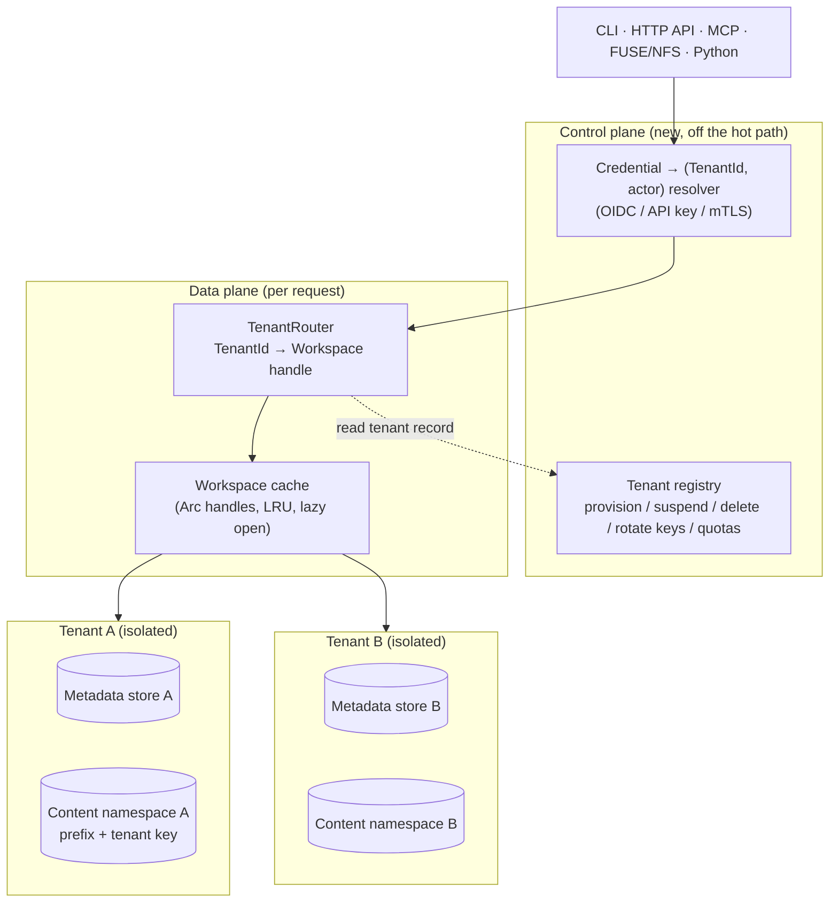

# Multi-tenancy in origofs — a concept

> Status: **concept / RFC.** This document extends `docs/DESIGN.md` (the authoritative
> design) to the multi-tenant case. It resolves the open question left in
> `DESIGN.md` §10 ("Multi-tenant dedup vs. privacy") and specifies *where* the
> tenant isolation boundary lives, *how* requests are routed to a tenant, and
> *what* changes in the code — grounded in what the engine actually does today,
> not the DDL sketch in `DESIGN.md` §5.
>
> It introduces no breaking change to the core `MetadataStore` / `ContentStore`
> traits for the default (silo) model; the invasive schema work is deferred to an
> optional density tier (MT3) that most deployments never need.

---

## 1. Goal, and what a "tenant" is

origofs is a shared human+agent filesystem with per-actor attribution. Today a
deployment serves **one** logical filesystem. To offer it as a service — many
independent organizations on shared infrastructure — we need **tenancy**: a hard
isolation domain such that one customer can never read, write, enumerate, or even
*infer the existence of* another customer's files, history, blame, audit trail, or
actors, and such that each customer's storage and load are separately accountable.

We define one new concept above the existing ones:

```
Tenant                      ← the isolation + billing + key domain (NEW)
  └── Workspace(s)          ← the existing unit: one (MetadataStore, ContentStore) pair
        └── Branch / working tree
              └── File (chunk-manifest → content chunks)
Actor (human | agent | system)   ← attribution identity, scoped to a tenant
```

- A **tenant** owns one or more **workspaces**. A workspace is unchanged from
  `DESIGN.md`: a metadata store paired with a content store. The tenant is the
  grouping that carries the security boundary, the content keyspace, the
  encryption key, and the quota — *not* a new thing files live in.
- **A workspace is _not_ a security boundary — the tenant is.** This is the ruling
  that makes many-workspaces-per-tenant cheap. Because the cross-tenant wall is the
  store itself, a workspace is just a unit of organization *inside* an already-
  resolved tenant (a project, a repo, an agent's scratch area). So — unlike the
  tenant, which is always resolved from the credential — a workspace **may be named
  in the request** (a path prefix or header), scoped under the resolved tenant.
  Naming the wrong workspace inside your own tenant is not a leak; naming another
  tenant's is impossible by construction. Whether a given actor may *reach* a given
  workspace is an optional intra-tenant authorization choice (§7), never an
  isolation requirement. Realized with **no engine change**: N workspaces = N
  store-pairs the registry tracks under `(TenantId, workspace) → locator` (§6, §10).
- **Actors** (the `actor` table, `DESIGN.md` §4d) belong to a tenant. Attribution
  truth stays exactly where it is today — in the tenant's own metadata DB — so
  blame and the op-log need no new columns in the silo model.
- Terminology note: `DESIGN.md` §5 sketches a `workspace_id` column on every table,
  anticipating many workspaces in one store. The implementation went the other way
  — **one store == one workspace, no discriminator column** (see §2). Multi-tenancy
  therefore introduces `TenantId` *above* the workspace rather than reviving
  `workspace_id`; §10 reconciles the two if we ever pool tenants onto shared tables.

Non-goals: this is about *isolating* tenants, not about cross-tenant sharing
features (org-to-org file sharing, a public read-only tenant) — those are a
separate design that would sit on top of the boundary defined here.

---

## 2. Where we are today (the honest baseline)

Multi-tenancy is easy to reason about here only because the current code has an
implicit, clean boundary. The facts, from the code and not the sketch:

- **One `MetadataStore` instance is one workspace.** The trait
  (`crates/origofs-core/src/metadata.rs`) has **no** `workspace_id`/`tenant_id`
  parameter on any method — `lookup(parent, name)`, `get_ref(name)`,
  `create_actor(init)` are all implicitly scoped to "this store." The migrations
  (`crates/origofs-core/src/migrations.rs`) create `inode`, `dentry`, `ref`,
  `config`, `actor`, `edit_op`, `blob_blame`, … with **no tenant column**. The
  isolation unit is the store, chosen at construction time.
- **`Workspace::open_*` pairs one metadata store with one content store**
  (`crates/origofs-sdk/src/lib.rs`). `open_local(db_path, cas_dir)`,
  `open_pg_s3(dsn, cfg)`, etc. Each call yields one isolated filesystem. There is
  no notion of selecting a tenant within an opened workspace.
- **Postgres connects one pool to the `public` schema.**
  `PostgresMetadataStore::connect(dsn)` (`postgres.rs`) builds a `deadpool` pool
  with no `search_path` manipulation and no schema-per-tenant. One database (or one
  schema) == one workspace.
- **Content is globally content-addressed and convergent.** `LocalCasStore`
  (`content.rs`) stores every blob at `objects/<hex[0..2]>/<hex[2..]>` keyed purely
  by `BLAKE3(bytes)`; the object/GCS/pack backends do the same. Two workspaces
  pointed at the same content store **share chunks by construction** — that is the
  dedup win *and* the cross-tenant hazard (§5b). `EncryptedStore` addresses by the
  **plaintext** hash (convergent encryption) with a nonce derived from that hash,
  so even encrypted content dedupes across whoever shares the store and the key.
- **The API/MCP each bind exactly one `Workspace`.** `origofs_api::router(ws, auth)`
  serves a single workspace; `origofs-mcp`'s server binds one workspace + one agent
  actor/session. Serving N tenants today means N processes or N `open_*` handles
  with no shared router.
- **Identity is already resolved server-side, and the surface refuses to guess.**
  `build_api_auth` (`crates/origofs-cli/src/main.rs`) *refuses to expose an
  unauthenticated API on a non-loopback address*, and `Principal`
  (`origofs-api/src/lib.rs`) is documented to never trust a client-named actor. This
  is the exact invariant we extend to tenancy: **the tenant is resolved
  server-side from a verified credential, never read from a path segment or body.**
- **The metadata DB is the per-tenant crown jewel.** Per `DESIGN.md` §7 and
  `CLAUDE.md`: the content store can rebuild *committed files* via `fsck --rebuild`,
  but **blame, the audit log, actors, and uncommitted edits live only in the DB**.
  Whatever the tenancy model, the DB is the thing that must be backed up and deleted
  per tenant.

**Consequence:** the smallest honest multi-tenant deployment already works —
run one `Workspace` per tenant, each with its own DSN/path and content location.
The concept below turns that into a first-class, single-process, safe-by-default
capability, and defines the sharing options for density.

---

## 3. Control plane vs. data plane

Multi-tenancy adds one small **control plane** (rare operations: provision,
suspend, delete, rotate keys, route) and one **data-plane** component (per
request: resolve → route → serve). The engine stays in the data plane, unchanged.



The **registry** is the source of truth for "which tenants exist and how to reach
each one": for each `TenantId`, a `TenantRecord { metadata_locator,
content_locator, key_ref, state, quota }`. It is itself just another metadata
store (its own small DB) and is *not* consulted on every file op — the router
caches the resolved `Workspace` handle.

---

## 4. The core tension: two stores pull in opposite directions

Every tenancy decision reduces to where the boundary sits in each of the two
stores, and the two stores have *opposite* natural inclinations:

| Store | Holds | Natural inclination | Why |
|---|---|---|---|
| **Metadata** | names, tree structure, refs, **blame, audit log, actors** | **isolate hard** | All of it is tenant-sensitive; a single missing predicate leaks a customer's file names or who-edited-what. |
| **Content** | content-addressed chunks/objects | **wants to share** | Convergent addressing means identical bytes dedupe globally — a real storage win — but sharing a keyspace is a cross-tenant **existence oracle**. |

So multi-tenancy is not one decision but two, taken per store, and the content
side is where the interesting privacy trade-off lives (the question `DESIGN.md`
§10 left open). §5 gives the menu and the ruling for each.

---

## 5. Isolation models — the menu and the ruling

### 5a. Metadata isolation (strongest → densest)

| Model | Mechanism | Isolation | Density | Migration cost | Best for |
|---|---|---|---|---|---|
| **Silo — DB per tenant** | one SQLite file or one Postgres database per tenant; router picks the DSN | **Hard** (no query can cross tenants; a leak requires connecting to the wrong DB) | Low | **None** — matches today's one-store-per-workspace | Enterprise / few large tenants; the default |
| **Bridge — schema per tenant** | one Postgres cluster, `search_path`/schema per tenant | Strong (schema `GRANT`s + search_path) | Medium | Small — set `search_path` on checkout from the pool | Many medium tenants on one cluster |
| **Pool — shared tables + `tenant_id`** | every row carries `tenant_id`; enforced by Postgres **Row-Level Security** | Conditional (only as strong as RLS + the mandatory predicate) | High | **Large** — add `tenant_id` to every table + a `TenantScoped` store | Very many small tenants |

### 5b. Content isolation (strongest → densest)

| Model | Mechanism | Cross-tenant dedup | Existence oracle? | Tenant delete / GC |
|---|---|---|---|---|
| **Namespace per tenant** | per-tenant bucket/prefix/root under one physical store | No | **No** | Trivial + safe (delete the prefix; GC is per-tenant) |
| **Shared store, per-tenant key** | one keyspace, but addresses **domain-separated by a tenant key** (tenant-keyed convergent encryption; the address folds in the tenant key) | Within a tenant only | **No** (A's and B's identical bytes get different addresses) | Crypto-shred (destroy the tenant key); GC per tenant |
| **Shared, global convergent** | today's behavior: one keyspace, `BLAKE3(bytes)` | Yes (max savings) | **Yes** — `has()`/dedup timing confirms exact bytes across tenants | Unsafe: a chunk may be live for another tenant |

The existence-oracle in the last row is concrete: with a globally shared
convergent store, tenant B can learn whether tenant A holds a specific file by
writing the same bytes and observing whether the `put` deduped (via timing, a
`has()` probe, or a storage-metering delta). For a filesystem that markets
*attribution and confidentiality*, that is not an acceptable default.

### The ruling

> **A tenant is the isolation boundary; a workspace is a unit of work inside it.
> Default to the _silo_ model — a tenant's metadata is its own database and its
> content its own key-separated namespace — and make _sharing_ (cross-tenant
> dedup, pooled tables) an explicit, trust-scoped opt-in layered on top, never the
> default.**

Three reasons this is the right default for *this* codebase specifically:

1. **It needs no core change.** The engine is already one-store-per-workspace with
   no tenant column; silo tenancy is reachable with a router + a registry and the
   existing `open_*` constructors. The most invasive option (pooled `tenant_id` +
   RLS) is exactly the schema the implementation deliberately does *not* have — so
   it belongs in an opt-in tier, not the default.
2. **It makes the dangerous operations tractable.** `gc` is mark-and-sweep from
   live refs and is explicitly *unsafe alongside active writers* (`CLAUDE.md`).
   Per-tenant content namespaces make GC and "delete this tenant" per-tenant and
   safe; a globally shared convergent store makes both a cross-tenant hazard (you
   cannot delete A's chunk if B's identical file references it).
3. **It matches the security posture already in the code.** Identity is resolved
   server-side and the surface refuses to guess (§2). Silo isolation is the
   storage-layer equivalent of that same fail-closed instinct.

Sharing is still available where it is *safe* and *wanted*: within one trust
domain (e.g. one organization's many workspaces) a deployment may point them at a
shared convergent content store to reclaim cross-workspace dedup — but that is a
choice made *inside* a tenant, never across the tenant boundary.

---

## 6. The new runtime piece: `TenantRouter`

One process should host many tenants, so we add a router in front of every
surface. It is the *only* substantial new data-plane code.

```mermaid
sequenceDiagram
  participant C as Client
  participant S as Surface (API / MCP / FUSE)
  participant R as Resolver + TenantRouter
  participant G as Tenant registry
  participant W as Workspace (tenant T)
  C->>S: request + credential (Bearer / JWT / mTLS)
  S->>R: authenticate(headers)
  R->>G: credential → (TenantId T, actor_id)
  Note over R,G: tenant resolved server-side —\nnever from a path segment or body
  G-->>R: (T, actor) · or reject 401/403
  R->>W: get-or-open Workspace(T) from the cache
  W-->>S: (actor, session) bound; op runs against T only
  S-->>C: result (only T's data was ever reachable)
```

Sketch (illustrative, not final):

```rust
/// Opaque, server-assigned tenant handle. Never parsed from client input.
pub struct TenantId(String);

/// Control-plane record: a tenant's policy + its set of workspaces.
pub struct TenantRecord {
    pub id:         TenantId,
    pub key_ref:    Option<KeyRef>,  // per-tenant encryption key (KMS/keyring handle)
    pub state:      TenantState,     // Active | Suspended | Deleting
    pub quota:      Quota,           // bytes, rate, connection share (whole tenant)
    pub workspaces: Map<WorkspaceName, WorkspaceLocator>,  // >= 1; "default" if unnamed
}

/// How to reach one workspace's stores. Two workspaces of one tenant may share a
/// content locator (safe intra-tenant dedup) or keep separate ones.
pub struct WorkspaceLocator {
    pub metadata: MetadataLocator,   // DSN | sqlite path | (cluster, schema)
    pub content:  ContentLocator,    // bucket/prefix/root (may be shared within the tenant)
}

/// Resolves a verified credential to the tenant + actor it acts as.
/// The tenant half is the new invariant; the actor half already exists (§2).
#[async_trait]
pub trait TenantResolver: Send + Sync {
    async fn resolve(&self, headers: &HeaderMap) -> Option<(TenantId, ActorRef)>;
}

/// Opens (once) and caches a Workspace per (tenant, workspace). Enforces `state`
/// (reject Suspended/Deleting) and applies the tenant key + the workspace's content
/// locator. The workspace name comes from the request; the tenant never does.
pub struct TenantRouter { /* registry + LRU<(TenantId, WorkspaceName), Arc<Workspace>> */ }
```

Design constraints on the router:

- **Tenant is resolved, never routed by URL.** The tenant comes from the
  credential. A `?tenant=` or `/t/{id}/...` scheme is rejected as an invariant
  violation — it is the storage-layer analogue of trusting a client-named actor.
- **The _workspace_, by contrast, may be named in the request.** Because it is not
  a security boundary (§1), the surface reads it from a path prefix
  (`/w/{workspace}/files/...`) or an `Origofs-Workspace` header, defaulting to
  `default`. It is looked up in the *already-resolved* tenant's workspace set, so a
  client can only ever name a workspace of its own tenant. The workspace is the one
  thing a client may select; the tenant is the one thing it may not.
- **Lazy open + bounded cache.** Workspaces open on first use and live in an LRU
  of `Arc<Workspace>` handles (cheap to clone — they are `Arc` pairs, §
  `crates/origofs-sdk/src/lib.rs`). This bounds connection-pool sprawl in the silo
  model (the main silo cost) and gives idle tenants near-zero footprint.
- **State gate.** `Suspended` → 403; `Deleting` → 404/410. Checked at
  get-or-open, before any op reaches the engine.
- **Extends, doesn't replace, `Authenticator`.** The existing `Authenticator`/
  `Principal` (`origofs-api`) becomes the actor half of `TenantResolver`; the tenant
  half wraps it. `LocalDevAuth` maps to a single built-in `default` tenant so the
  loopback dev path is unchanged.

---

## 7. Identity & authorization across tenants

The `actor` model (`DESIGN.md` §4d) is unchanged *inside* a tenant. What tenancy
adds is the **outer** resolution and the guarantee that an actor id from tenant A
is meaningless in tenant B.

- **Two-level identity.** The control plane maps an external identity (OIDC
  subject, API key, mTLS cert) → `(TenantId, actor auth_subject)`. The tenant's own
  DB then maps `auth_subject` → local `actor_id` via the existing
  `find_or_create_human` / `actor_by_subject` path — which is already race-safe (a
  partial UNIQUE index on `auth_subject`, migration V9). No user→actor side table,
  no cross-tenant actor id space.
- **Actor ids are tenant-local and never cross the boundary.** Because each tenant
  is its own store, `actor_id = 42` in tenant A and in tenant B are unrelated rows.
  A bearer token that resolves to `(A, actor 42)` can never address `(B, *)`.
- **Roles are a control-plane concern.** Within a tenant, the existing per-actor
  **write policy** (`WritePolicy::Direct | Propose`, migration V10) already gives a
  bounded trust gate (an untrusted agent's writes route through the suggestion
  queue). Cross-tenant admin roles (who may provision/suspend/delete a tenant) live
  in the registry, not in any tenant's DB.
- **Workspace access is intra-tenant authorization, not isolation.** All of a
  tenant's actors may reach all of its workspaces by default; a deployment that
  wants per-workspace scoping (project A's agent can't touch project B) enforces it
  in the resolver/router as a policy check *after* the tenant is resolved. Getting
  it wrong is a within-tenant authz bug, never a cross-tenant breach — the store
  wall still holds.
- **The invariant, stated once:** *origofs trusts neither a client-named actor nor a
  client-named tenant; both are resolved server-side from a verified credential.*
  This is a one-line extension of the rule already enforced in `build_api_auth`.

---

## 8. Cross-cutting subsystems under multi-tenancy

**Refs / branches / working tree.** Per-store today, so per-tenant for free in the
silo/bridge models. Only the pooled model (MT3) needs `tenant_id` folded into the
`ref` primary key and the inode/dentry rows — the point at which `DESIGN.md` §5's
sketch finally gets built, promoted one level to `tenant_id`.

**Attribution, blame, audit — the compliance win.** In the silo model a tenant's
`edit_op` log, `blob_blame`, `tool_calls`, and `actor` rows never share a table
with another tenant's. That is exactly the "tenant data segregation" auditors ask
for (SOC 2 / ISO 27001 / GDPR data-subject export & erasure): a tenant's entire
attribution history is one DB you can export, or drop, atomically. This is a
genuine reason to prefer silo beyond mere caution.

**GC & tenant deletion.** `gc` is mark-and-sweep from live refs and unsafe with
active writers (`CLAUDE.md`). Per-tenant content namespaces make it per-tenant:
mark from *this* tenant's refs, sweep *this* tenant's prefix, during *this*
tenant's maintenance window — no cross-tenant reachability analysis. **Deleting a
tenant** becomes: set `state = Deleting` (router stops serving it) → drop its
metadata DB (crown-jewel data gone, including all attribution) → delete its content
prefix (or, with per-tenant keys, just destroy the key = **crypto-shred**, leaving
the ciphertext unreadable and reclaimable lazily). With a *globally shared
convergent* store none of this is safe — another tenant may hold the identical
chunk — which is the fourth argument for the ruling.

**Encryption & key management.** `ORIGOFS_ENCRYPTION_KEY` is per-workspace/global
today and kept out of argv (`CLAUDE.md`). Multi-tenancy makes it **per-tenant**,
one DEK per tenant behind a `KeyRef` (KMS / keyring), so: (a) a tenant's data is
cryptographically isolated even on shared physical storage; (b) key destruction is
a clean, instant tenant erase; (c) with tenant-keyed convergent encryption the
content **address** is domain-separated, closing the existence oracle while keeping
*intra*-tenant dedup (§5b, model 2). `EncryptedStore` already refuses any
non-content-addressed key via `put_keyed` (`DESIGN.md` §7); the tenant-keyed
variant folds the tenant key into the address/nonce derivation without weakening
that check.

**Quotas, metering, noisy-neighbor.** The registry carries a per-tenant `Quota`
(stored bytes, request rate, connection share). Silo makes **metering trivial** —
storage is "the size of this tenant's DB + prefix," load is "requests to this
tenant's handle." The shared Postgres cluster is the contended resource: cap each
tenant's slice of the `deadpool` pool and rate-limit at the router so one tenant's
agent swarm can't starve the cluster (Postgres advisory locks + ref CAS are the
only global-ish serialization points, `DESIGN.md` §7, and they are per-inode /
per-branch, i.e. naturally per-tenant here).

**Backup / restore / recovery.** The DB is the per-tenant thing to back up
(attribution is not reconstructable from content — §2). Silo gives per-tenant
Postgres PITR / per-tenant SQLite replication and a per-tenant restore blast
radius. `fsck --rebuild` (`Workspace::rebuild`) already reconstructs committed
files from a tenant's content namespace onto a fresh DB — that flow is unchanged,
just pointed at one tenant's stores.

**Change feed / presence / co-edit relay.** `LISTEN/NOTIFY` (`origofs_events`) and
the co-edit relay are per-store, hence per-tenant in silo/bridge. In the pooled
model the NOTIFY channel and relay table must be tenant-scoped (channel name or
payload filter) so a subscriber only ever sees its own tenant's events.

---

## 9. Threat model & isolation guarantees

| Threat | Mitigation | Weakest model that holds |
|---|---|---|
| Cross-tenant **read/write** of files/metadata | Tenant resolved server-side → separate store per tenant; pooled model needs RLS + mandatory predicate | Silo/Bridge by construction; Pool only with RLS |
| **Tenant spoofing** (client names a tenant) | Tenant comes from the verified credential, never a path/body — extends the existing "never trust client-named actor" rule | All models |
| Cross-tenant **attribution forgery** | Actor ids are tenant-local; resolver binds `(tenant, actor)` from one credential | All models |
| **Existence oracle** via shared dedup | Per-tenant content namespace, or tenant-keyed convergent addressing (domain separation) | Namespace-per-tenant / per-tenant-key |
| **GC deletes a live cross-tenant chunk** | Per-tenant content namespace → GC never spans tenants | Namespace-per-tenant / per-tenant-key |
| **Noisy neighbor** (DoS via one tenant) | Per-tenant pool cap + router rate limit + quota | All (router-enforced) |
| **Backup/restore crosses tenants** | Per-tenant DB + per-tenant prefix → per-tenant backup unit | Silo/Bridge |
| **Incomplete erasure** (right-to-be-forgotten) | Drop tenant DB + delete prefix, or destroy per-tenant key (crypto-shred) | Silo + per-tenant key |
| **Key confusion across tenants** | One DEK per tenant behind a `KeyRef`; wrong key fails closed (AEAD tag), never returns another tenant's plaintext | All (per-tenant key) |

**Guarantee (silo default):** absent a bug in the ~200-line router, a request
authenticated as tenant A can reach only tenant A's metadata DB and content
namespace. No engine query can cross tenants because no engine query takes a
tenant argument — the isolation is structural, not predicate-enforced.

---

## 10. What changes in the code

Deltas, smallest-first. MT1 (the useful milestone) touches no core trait.

**MT1 — silo, additive only:**
- New crate/module `origofs-tenant` (or `origofs-sdk::tenant`): `TenantId`,
  `TenantRecord`, `TenantState`, `Quota`, a `TenantRegistry` trait (backed by its
  own `MetadataStore`), and `TenantRouter` with the LRU workspace cache.
- New `TenantResolver` trait in `origofs-api`; the existing `Authenticator` becomes
  its actor half. `router`/`serve` gain a `router_multitenant(registry, resolver)`
  variant; the single-tenant `router(ws, auth)` stays for the loopback/dev path
  (mapped to a built-in `default` tenant + `default` workspace). The router reads the
  **workspace name** from a path prefix or header (defaulting to `default`) and keys
  its handle cache by `(TenantId, workspace)`.
- `Workspace::open_*` grow content-locator plumbing: a per-workspace **prefix** on the
  object/local store and an optional per-tenant **key** (`open_pg_s3_for_tenant(...)`
  thin wrappers, or a `ContentLocator` the router applies). No new engine API — a
  tenant's N workspaces are N `open_*` calls, so **multi-workspace needs no schema
  change**. (Optional PG density: keep one connection pool per *tenant* by putting
  each workspace in its own **schema** of the tenant's database via `search_path` — a
  small, contained addition to `PostgresMetadataStore::connect`, not an engine change.)
- A **migration fan-out** runner: `migrate` today is per-store
  (`Workspace::migrate`); add a control-plane loop that applies pending migrations
  across all active tenants on deploy.

**MT3 — density tier, invasive (optional):**
- Add `tenant_id` to the metadata schema (finally realizing `DESIGN.md` §5,
  promoted to the tenant grain) *behind a `TenantScoped<M: MetadataStore>`
  decorator* that injects the predicate, plus Postgres **RLS** as the enforcement
  backstop. Ships as a new backend choice, not a change to the existing SQLite/PG
  stores.
- Tenant-keyed convergent content addressing for a shared bucket with
  intra-tenant-only dedup (§5b model 2).

Reconciliation with `DESIGN.md` §5: the sketch's `workspace_id` was a *workspace*
discriminator. The security boundary is the **tenant**, so the pooled discriminator
should be `tenant_id` (coarse, the boundary) and *optionally* `workspace_id` (fine,
a grouping within a tenant). Silo/Bridge need neither column; only MT3 adds them.

---

## 11. Phased roadmap (MT-series, mirroring `DESIGN.md` §9)

| Milestone | Deliverable | Unlocks |
|---|---|---|
| **MT0 — Model & registry** | `TenantId`/`TenantRecord`/`TenantState`/`Quota`; `TenantRegistry` trait over its own metadata store; the server-side-tenant invariant written down and tested | The vocabulary + control-plane data model; no hot-path change |
| **MT1 — Silo runtime** | `TenantResolver` + `TenantRouter` in front of the HTTP API & MCP; workspace selected per request (`(TenantId, workspace)` handle cache); per-workspace `open_*` (content prefix + per-tenant key); migration fan-out | **One process hosts many hard-isolated tenants, each with many workspaces** — no core schema change |
| **MT2 — Lifecycle & accounting** | provision / suspend / delete (drop DB + crypto-shred); per-tenant GC; quotas, metering, per-tenant pool cap + rate limit; per-tenant backup/restore | Operable as a service: onboarding, erasure, billing, noisy-neighbor safety |
| **MT3 — Density tier (optional)** | schema-per-tenant (bridge) and/or shared-schema `tenant_id` + Postgres RLS behind `TenantScoped`; tenant-keyed convergent dedup | Many small tenants per cluster without per-tenant DB overhead |

MT1 is the point of first value; MT2 makes it a product; MT3 is for scale and can
be skipped by deployments with few, large tenants.

---

## 12. Open questions

- **Density of workspaces _within_ a tenant.** Decided: a tenant owns **many
  workspaces** (§1), each its own store-pair, routed by `(TenantId, workspace)` — no
  schema change. The remaining sub-question is how to keep that cheap when one tenant
  has *many* workspaces: separate databases (one pool each — simplest, heaviest),
  separate **schemas** in the tenant's database (one pool per tenant, `DROP SCHEMA`
  to delete a workspace — the recommended Postgres default), or shared tables with a
  `workspace_id` column (densest, invasive — the §5 sketch, worth it only at extreme
  workspace counts). Start with separate stores; add schema-per-workspace when pool
  count bites.
- **Bridge vs. pool as the density tier.** Schema-per-tenant is simpler and keeps
  most of silo's isolation; shared-schema+RLS is denser but one predicate away from
  a leak. Pick one primary; possibly offer both.
- **Per-tenant key custody.** KMS (managed, auditable, per-region cost) vs. an
  operator keyring vs. customer-held keys (BYOK, strongest erasure story, hardest
  ops). Affects the crypto-shred guarantee's blast radius.
- **Cross-tenant dedup as a paid, opt-in trust group.** Some customers *want* to
  share a dedup domain (e.g. subsidiaries). Model it as an explicit "dedup group"
  above tenants, with the existence-oracle accepted *within* the group only.
- **Control-plane HA.** The registry is on the resolution path (cached, but cold
  tenants hit it). Its own replication/backup and a signed-token fast path (so a
  valid token carries `TenantId` and skips the registry read) are worth specifying.
- **Live co-edit across a pooled model.** Tenant-scoping the `LISTEN/NOTIFY`
  channel and the relay table so a shared cluster never fans one tenant's edits to
  another's sockets.
```
