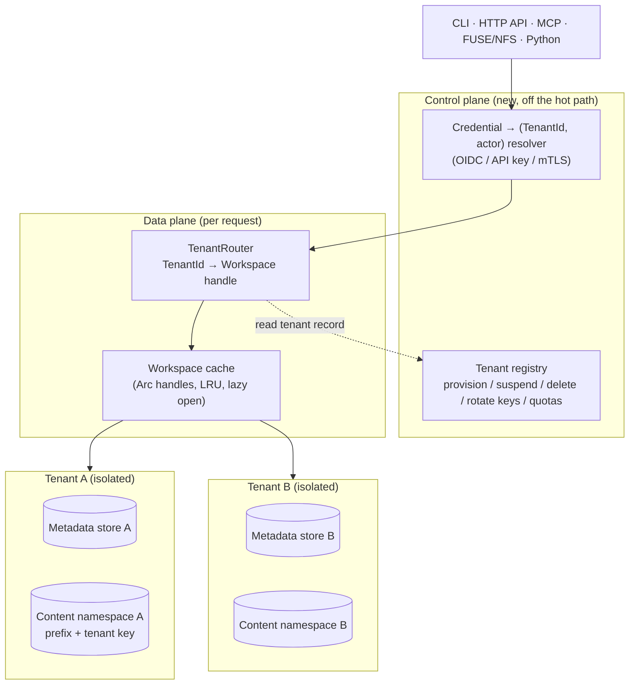

# Multi-tenancy in origofs — a concept

> Status: **concept / RFC.** This document extends `docs/DESIGN.md` (the authoritative
> design) to the multi-tenant case. It resolves the open question left in
> `DESIGN.md` §10 ("Multi-tenant dedup vs. privacy") and specifies *where* the
> tenant isolation boundary lives, *how* requests are routed to a tenant, and
> *what* changes in the code — grounded in what the engine actually does today,
> not the DDL sketch in `DESIGN.md` §5.
>
> Two boundaries, each sized to the threat. **Tenants** are isolated *structurally*
> — a separate metadata store + content namespace per tenant. **Workspaces** share
> their tenant's one store and are separated by a `workspace_id` discriminator — the
> layout `DESIGN.md` §5 sketched from the start. The `MetadataStore` / `ContentStore`
> *traits* stay unchanged (the `workspace_id` is ambient on the concrete store handle,
> §6); the schema gains the discriminator column and a per-workspace root inode.

---

## 1. Goal, and what a "tenant" is

origofs is a shared human+agent filesystem with per-actor attribution. Today a
deployment serves **one** logical filesystem. To offer it as a service — many
independent organizations on shared infrastructure — we need **tenancy**: a hard
isolation domain such that one customer can never read, write, enumerate, or even
*infer the existence of* another customer's files, history, blame, audit trail, or
actors, and such that each customer's storage and load are separately accountable.

We define one new concept above the existing ones:

```
Tenant                      ← the isolation + billing + key domain (NEW)
  └── Workspace(s)          ← the existing unit: one (MetadataStore, ContentStore) pair
        └── Branch / working tree
              └── File (chunk-manifest → content chunks)
Actor (human | agent | system)   ← attribution identity, scoped to a tenant
```

- A **tenant** owns one or more **workspaces**. A workspace is unchanged from
  `DESIGN.md`: a metadata store paired with a content store. The tenant is the
  grouping that carries the security boundary, the content keyspace, the
  encryption key, and the quota — *not* a new thing files live in.
- **A workspace is _not_ a security boundary — the tenant is.** That ruling sizes
  the isolation. Because the cross-tenant wall is the store itself, a workspace does
  not need its own store; it is a unit of organization *inside* a resolved tenant (a
  project, a repo, an agent's scratch area). So **all of a tenant's workspaces live
  in that tenant's one metadata store and one content store, separated by a
  `workspace_id`** — the `DESIGN.md` §5 layout. Precisely: cross-**tenant** isolation
  is *structural* (separate stores, cannot leak by construction); cross-**workspace**
  isolation is a *soft predicate* inside the store (a `workspace_id` filter + a
  per-workspace root inode), where a bug is a within-tenant mix-up, never a customer
  breach. And — unlike the tenant, always resolved from the credential — a workspace
  **may be named in the request** (a path prefix or header), looked up in the
  already-resolved tenant's store; naming another tenant's is impossible. Whether an
  actor may *reach* a given workspace is an optional intra-tenant authorization
  choice (§7). The mechanism is in §6; the code delta in §10.
- **Actors** (the `actor` table, `DESIGN.md` §4d) belong to a tenant and are
  **shared across that tenant's workspaces** — Alice is one actor in every project,
  and the audit trail is one table per tenant. Attribution truth stays in the
  tenant's store; the op-log gains only a `workspace_id` tag for per-workspace
  history, and blame stays keyed by content hash (so it is shared by content across
  workspaces — §6, §12).
- Terminology note: `DESIGN.md` §5 sketches a `workspace_id` column on every table,
  anticipating many workspaces in one store; the current implementation hasn't built
  it yet (**one store == one workspace, no discriminator column** — see §2). This
  concept **builds that sketch** at the workspace grain and adds `TenantId` *above*
  it as the structural boundary. `tenant_id` becomes a column only if a deployment
  later pools multiple tenants into one store too (§10, the optional MT4 tier).

Non-goals: this is about *isolating* tenants, not about cross-tenant sharing
features (org-to-org file sharing, a public read-only tenant) — those are a
separate design that would sit on top of the boundary defined here.

---

## 2. Where we are today (the honest baseline)

Multi-tenancy is easy to reason about here only because the current code has an
implicit, clean boundary. The facts, from the code and not the sketch:

- **One `MetadataStore` instance is one workspace.** The trait
  (`crates/origofs-core/src/metadata.rs`) has **no** `workspace_id`/`tenant_id`
  parameter on any method — `lookup(parent, name)`, `get_ref(name)`,
  `create_actor(init)` are all implicitly scoped to "this store." The migrations
  (`crates/origofs-core/src/migrations.rs`) create `inode`, `dentry`, `ref`,
  `config`, `actor`, `edit_op`, `blob_blame`, … with **no tenant column**. The
  isolation unit is the store, chosen at construction time.
- **`Workspace::open_*` pairs one metadata store with one content store**
  (`crates/origofs-sdk/src/lib.rs`). `open_local(db_path, cas_dir)`,
  `open_pg_s3(dsn, cfg)`, etc. Each call yields one isolated filesystem. There is
  no notion of selecting a tenant within an opened workspace.
- **Postgres connects one pool to the `public` schema.**
  `PostgresMetadataStore::connect(dsn)` (`postgres.rs`) builds a `deadpool` pool
  with no `search_path` manipulation and no schema-per-tenant. One database (or one
  schema) == one workspace.
- **Content is globally content-addressed and convergent.** `LocalCasStore`
  (`content.rs`) stores every blob at `objects/<hex[0..2]>/<hex[2..]>` keyed purely
  by `BLAKE3(bytes)`; the object/GCS/pack backends do the same. Two workspaces
  pointed at the same content store **share chunks by construction** — that is the
  dedup win *and* the cross-tenant hazard (§5b). `EncryptedStore` addresses by the
  **plaintext** hash (convergent encryption) with a nonce derived from that hash,
  so even encrypted content dedupes across whoever shares the store and the key.
- **The API/MCP each bind exactly one `Workspace`.** `origofs_api::router(ws, auth)`
  serves a single workspace; `origofs-mcp`'s server binds one workspace + one agent
  actor/session. Serving N tenants today means N processes or N `open_*` handles
  with no shared router.
- **Identity is already resolved server-side, and the surface refuses to guess.**
  `build_api_auth` (`crates/origofs-cli/src/main.rs`) *refuses to expose an
  unauthenticated API on a non-loopback address*, and `Principal`
  (`origofs-api/src/lib.rs`) is documented to never trust a client-named actor. This
  is the exact invariant we extend to tenancy: **the tenant is resolved
  server-side from a verified credential, never read from a path segment or body.**
- **The metadata DB is the per-tenant crown jewel.** Per `DESIGN.md` §7 and
  `CLAUDE.md`: the content store can rebuild *committed files* via `fsck --rebuild`,
  but **blame, the audit log, actors, and uncommitted edits live only in the DB**.
  Whatever the tenancy model, the DB is the thing that must be backed up and deleted
  per tenant.

**Consequence:** the smallest honest multi-tenant deployment already works —
run one `Workspace` per tenant, each with its own DSN/path and content location.
The concept below turns that into a first-class, single-process, safe-by-default
capability, and defines the sharing options for density.

---

## 3. Control plane vs. data plane

Multi-tenancy adds one small **control plane** (rare operations: provision,
suspend, delete, rotate keys, route) and one **data-plane** component (per
request: resolve → route → serve). The engine stays in the data plane, unchanged.



The **registry** is the source of truth for "which tenants exist and how to reach
each one": for each `TenantId`, a `TenantRecord { metadata_locator,
content_locator, key_ref, state, quota }`. It is itself just another metadata
store (its own small DB) and is *not* consulted on every file op — the router
caches the resolved `Workspace` handle.

---

## 4. The core tension: two stores pull in opposite directions

Every tenancy decision reduces to where the boundary sits in each of the two
stores, and the two stores have *opposite* natural inclinations:

| Store | Holds | Natural inclination | Why |
|---|---|---|---|
| **Metadata** | names, tree structure, refs, **blame, audit log, actors** | **isolate hard** | All of it is tenant-sensitive; a single missing predicate leaks a customer's file names or who-edited-what. |
| **Content** | content-addressed chunks/objects | **wants to share** | Convergent addressing means identical bytes dedupe globally — a real storage win — but sharing a keyspace is a cross-tenant **existence oracle**. |

So multi-tenancy is not one decision but two, taken per store, and the content
side is where the interesting privacy trade-off lives (the question `DESIGN.md`
§10 left open). §5 gives the menu and the ruling for each.

---

## 5. Isolation models — the menu and the ruling

### 5a. Metadata isolation (strongest → densest)

| Model | Mechanism | Isolation | Density | Migration cost | Best for |
|---|---|---|---|---|---|
| **Silo — DB per tenant** | one SQLite file or one Postgres database per tenant; router picks the DSN | **Hard** (no query can cross tenants; a leak requires connecting to the wrong DB) | Low | **None** for the tenant boundary (matches today's single-store model) | Enterprise / few large tenants; the default |
| **Bridge — schema per tenant** | one Postgres cluster, `search_path`/schema per tenant | Strong (schema `GRANT`s + search_path) | Medium | Small — set `search_path` on checkout from the pool | Many medium tenants on one cluster |
| **Pool — shared tables + `tenant_id`** | every row carries `tenant_id`; enforced by Postgres **Row-Level Security** | Conditional (only as strong as RLS + the mandatory predicate) | High | **Large** — add `tenant_id` to every table + a `TenantScoped` store | Very many small tenants |

> This table is the **tenant** boundary — the security wall, and the default is silo.
> *Within* a tenant, workspaces are always the **pool** row: one store, a
> `workspace_id` discriminator (§6). That is deliberate and right-sized — a workspace
> is not a security boundary (§1), so it takes a soft predicate, not its own store.

### 5b. Content isolation (strongest → densest)

| Model | Mechanism | Cross-tenant dedup | Existence oracle? | Tenant delete / GC |
|---|---|---|---|---|
| **Namespace per tenant** | per-tenant bucket/prefix/root under one physical store | No | **No** | Trivial + safe (delete the prefix; GC is per-tenant) |
| **Shared store, per-tenant key** | one keyspace, but addresses **domain-separated by a tenant key** (tenant-keyed convergent encryption; the address folds in the tenant key) | Within a tenant only | **No** (A's and B's identical bytes get different addresses) | Crypto-shred (destroy the tenant key); GC per tenant |
| **Shared, global convergent** | today's behavior: one keyspace, `BLAKE3(bytes)` | Yes (max savings) | **Yes** — `has()`/dedup timing confirms exact bytes across tenants | Unsafe: a chunk may be live for another tenant |

The existence-oracle in the last row is concrete: with a globally shared
convergent store, tenant B can learn whether tenant A holds a specific file by
writing the same bytes and observing whether the `put` deduped (via timing, a
`has()` probe, or a storage-metering delta). For a filesystem that markets
*attribution and confidentiality*, that is not an acceptable default.

### The ruling

> **A tenant is the isolation boundary; a workspace is a unit of work inside it.
> Default to the _silo_ model — a tenant's metadata is its own database and its
> content its own key-separated namespace — and make _sharing_ (cross-tenant
> dedup, pooled tables) an explicit, trust-scoped opt-in layered on top, never the
> default.**

Three reasons this is the right default for *this* codebase specifically:

1. **The tenant boundary needs no core change.** Isolating tenants is store-per-tenant
   + a router + a registry over the existing `open_*` constructors; no query gains a
   `tenant` argument. (The *workspace* layer inside a tenant does add the `workspace_id`
   column + per-workspace root inode — §6, §10 — but keeps the `MetadataStore` trait
   unchanged.) The most invasive option, pooling *tenants* onto shared tables with
   `tenant_id` + RLS, is exactly what the schema deliberately lacks — so it stays an
   opt-in tier (MT4), not the default.
2. **It makes the dangerous operations tractable.** `gc` is mark-and-sweep from
   live refs and is explicitly *unsafe alongside active writers* (`CLAUDE.md`).
   Per-tenant content namespaces make GC and "delete this tenant" per-tenant and
   safe; a globally shared convergent store makes both a cross-tenant hazard (you
   cannot delete A's chunk if B's identical file references it).
3. **It matches the security posture already in the code.** Identity is resolved
   server-side and the surface refuses to guess (§2). Silo isolation is the
   storage-layer equivalent of that same fail-closed instinct.

Sharing is still available where it is *safe* and *wanted*: within one trust
domain (e.g. one organization's many workspaces) a deployment may point them at a
shared convergent content store to reclaim cross-workspace dedup — but that is a
choice made *inside* a tenant, never across the tenant boundary.

---

## 6. The new runtime piece: `TenantRouter`

One process should host many tenants, so we add a router in front of every
surface. It is the *only* substantial new data-plane code.

```mermaid
sequenceDiagram
  participant C as Client
  participant S as Surface (API / MCP / FUSE)
  participant R as Resolver + TenantRouter
  participant G as Tenant registry
  participant W as Workspace (tenant T)
  C->>S: request + credential (Bearer / JWT / mTLS)
  S->>R: authenticate(headers)
  R->>G: credential → (TenantId T, actor_id)
  Note over R,G: tenant resolved server-side —\nnever from a path segment or body
  G-->>R: (T, actor) · or reject 401/403
  R->>W: get-or-open Workspace(T) from the cache
  W-->>S: (actor, session) bound; op runs against T only
  S-->>C: result (only T's data was ever reachable)
```

Sketch (illustrative, not final):

```rust
/// Opaque, server-assigned tenant handle. Never parsed from client input.
pub struct TenantId(String);

/// Control-plane record: one store + one content namespace + policy, per tenant.
pub struct TenantRecord {
    pub id:       TenantId,
    pub metadata: MetadataLocator,   // the tenant's ONE store (DSN | sqlite path | schema)
    pub content:  ContentLocator,    // the tenant's ONE content namespace (bucket/prefix)
    pub key_ref:  Option<KeyRef>,    // per-tenant encryption key (KMS/keyring handle)
    pub state:    TenantState,       // Active | Suspended | Deleting
    pub quota:    Quota,             // bytes, rate, connection share (whole tenant)
}
// Workspaces are NOT enumerated here — they are rows in the tenant's own store
// (the `workspace` table, §10). The router resolves a workspace *name* against that
// store and binds a `workspace_id`-scoped handle over the one shared connection/pool.

/// Resolves a verified credential to the tenant + actor it acts as.
/// The tenant half is the new invariant; the actor half already exists (§2).
#[async_trait]
pub trait TenantResolver: Send + Sync {
    async fn resolve(&self, headers: &HeaderMap) -> Option<(TenantId, ActorRef)>;
}

/// Opens the tenant's store once, then binds a `workspace_id`-scoped Workspace
/// handle over it per (tenant, workspace). Enforces `state` (reject
/// Suspended/Deleting) and applies the tenant key + content namespace. The workspace
/// name comes from the request; the tenant never does.
pub struct TenantRouter { /* registry + LRU<(TenantId, WorkspaceName), Arc<Workspace>> */ }
```

Design constraints on the router:

- **Tenant is resolved, never routed by URL.** The tenant comes from the
  credential. A `?tenant=` or `/t/{id}/...` scheme is rejected as an invariant
  violation — it is the storage-layer analogue of trusting a client-named actor.
- **The _workspace_, by contrast, may be named in the request.** Because it is not
  a security boundary (§1), the surface reads it from a path prefix
  (`/w/{workspace}/files/...`) or an `Origofs-Workspace` header, defaulting to
  `default`. It is looked up in the *already-resolved* tenant's workspace set, so a
  client can only ever name a workspace of its own tenant. The workspace is the one
  thing a client may select; the tenant is the one thing it may not.
- **Lazy open + bounded cache.** A tenant's store opens on first use; per-workspace
  handles are `for_workspace`-scoped clones sharing that one store's connection/pool,
  held in an LRU (cheap — `Arc` pairs, `crates/origofs-sdk/src/lib.rs`). So pool
  sprawl is **per-tenant, not per-workspace**, and idle tenants have near-zero
  footprint.
- **State gate.** `Suspended` → 403; `Deleting` → 404/410. Checked at
  get-or-open, before any op reaches the engine.
- **Extends, doesn't replace, `Authenticator`.** The existing `Authenticator`/
  `Principal` (`origofs-api`) becomes the actor half of `TenantResolver`; the tenant
  half wraps it. `LocalDevAuth` maps to a built-in `default` tenant + `default`
  workspace so the loopback dev path is unchanged.

### Workspaces share one store — the `workspace_id` model

**Ruling** (this is the decision that drives §10): within a tenant, **all workspaces
live in the tenant's single metadata store and single content store, separated by a
`workspace_id`** — the layout `DESIGN.md` §5 drew. Store-per-workspace is *not* used.
It is the right size for the threat model — a workspace is not a security boundary
(§1) — and it buys one DB to operate, one connection pool, one migration run, one
change feed, one actor registry, and free cross-workspace content dedup.

| Boundary | Kind | Mechanism | A bug here is |
|---|---|---|---|
| Cross-**tenant** | Hard / structural | separate store + content namespace per tenant (§5) | a customer-data breach — must never happen |
| Cross-**workspace** (same tenant) | Soft / predicate | `workspace_id` filter + per-workspace root inode, inside the tenant's store | a within-tenant mix-up — bounded, not a breach |

How it works in this codebase (the honest delta — more than the router; see §10 for
the migration/trait specifics):

- **A `workspace` registry table** in the store — `workspace(id PK, name UNIQUE,
  root_ino, …)` — and each workspace gets its **own root inode**, replacing the single
  `INO_ROOT` constant. Inodes share one global `ino` sequence, so workspaces' inode/
  dentry subtrees are naturally disjoint; `workspace_id` is defense-in-depth plus fast
  per-workspace enumeration and `truncate_tree`.
- **`workspace_id` on the namespace-keyed tables** (`ref`, `config`, `conflict`,
  `file_lock`) — every workspace has its own `HEAD` and `refs/heads/main`, which would
  collide otherwise — and as a tag on `fs_event`/`suggestion` (which already carry
  `branch`). `symlink` (keyed by the global `ino`) needs nothing.
- **The `MetadataStore` trait is unchanged.** The `workspace_id` is *ambient* on the
  concrete store: `for_workspace(id)` returns a handle sharing the same connection/pool
  that scopes every statement. The engine binds one workspace by holding that scoped
  handle + its root inode; a store-level handle serves the registry and GC.
- **Actors, sessions, and the op-log are tenant-wide** (shared across the store's
  workspaces); `blob_blame` stays keyed by content hash, so identical content shares
  blame across workspaces — consistent with blame-following-content (`DESIGN.md` V8),
  and de-shareable as `(workspace_id, content_hash)` if a deployment wants it (§12).
- **Content is one shared store per tenant**, so cross-workspace dedup is automatic —
  which makes **GC per-store (per-tenant)**: it marks from *every* workspace's refs
  before sweeping. Deleting one workspace is metadata-only (its content is reclaimed by
  the next store GC).

---

## 7. Identity & authorization across tenants

The `actor` model (`DESIGN.md` §4d) is unchanged *inside* a tenant. What tenancy
adds is the **outer** resolution and the guarantee that an actor id from tenant A
is meaningless in tenant B.

- **Two-level identity.** The control plane maps an external identity (OIDC
  subject, API key, mTLS cert) → `(TenantId, actor auth_subject)`. The tenant's own
  DB then maps `auth_subject` → local `actor_id` via the existing
  `find_or_create_human` / `actor_by_subject` path — which is already race-safe (a
  partial UNIQUE index on `auth_subject`, migration V9). No user→actor side table,
  no cross-tenant actor id space.
- **Actor ids are tenant-local and never cross the boundary.** Because each tenant
  is its own store, `actor_id = 42` in tenant A and in tenant B are unrelated rows.
  A bearer token that resolves to `(A, actor 42)` can never address `(B, *)`.
- **Roles are a control-plane concern.** Within a tenant, the existing per-actor
  **write policy** (`WritePolicy::Direct | Propose`, migration V10) already gives a
  bounded trust gate (an untrusted agent's writes route through the suggestion
  queue). Cross-tenant admin roles (who may provision/suspend/delete a tenant) live
  in the registry, not in any tenant's DB.
- **Workspace access is intra-tenant authorization, not isolation.** All of a
  tenant's actors may reach all of its workspaces by default; a deployment that
  wants per-workspace scoping (project A's agent can't touch project B) enforces it
  in the resolver/router as a policy check *after* the tenant is resolved. Getting
  it wrong is a within-tenant authz bug, never a cross-tenant breach — the store
  wall still holds.
- **The invariant, stated once:** *origofs trusts neither a client-named actor nor a
  client-named tenant; both are resolved server-side from a verified credential.*
  This is a one-line extension of the rule already enforced in `build_api_auth`.

---

## 8. Cross-cutting subsystems under multi-tenancy

**Refs / branches / working tree.** Now **workspace-scoped within the tenant's
store**: `ref`, `config`, `conflict`, and `file_lock` gain `workspace_id` in their
keys (every workspace has its own `HEAD` and `refs/heads/main`), and inode/dentry
rows carry a `workspace_id` tag with each workspace rooted at its own inode (§6, §10).
Across tenants they stay separated by the store boundary. This is exactly
`DESIGN.md` §5's `workspace_id` sketch, built.

**Attribution, blame, audit — the compliance win.** In the silo model a tenant's
`edit_op` log, `blob_blame`, `tool_calls`, and `actor` rows never share a table
with another tenant's. That is exactly the "tenant data segregation" auditors ask
for (SOC 2 / ISO 27001 / GDPR data-subject export & erasure): a tenant's entire
attribution history is one DB you can export, or drop, atomically. This is a
genuine reason to prefer silo beyond mere caution.

**GC & deletion.** `gc` is mark-and-sweep from live refs and unsafe with active
writers (`CLAUDE.md`). Because workspaces share a store's content, GC is **per-store
(per-tenant)**: mark from *every* workspace's refs, then sweep — never per-workspace,
or you would delete a chunk another workspace still references. **Deleting one
workspace** is metadata-only: drop its `workspace`/`ref`/`config`/lock rows and
`truncate_tree` its inodes; its uniquely-referenced content is reclaimed by the next
store GC. **Deleting a tenant** stays structural: set `state = Deleting` (router stops
serving it) → drop the tenant's store (crown-jewel data + all attribution gone) →
delete its content prefix, or destroy its per-tenant key = **crypto-shred**. The
cross-tenant hazards of a *globally shared convergent* store — a chunk still live for
another tenant — are exactly what the per-tenant store + namespace avoid.

**Encryption & key management.** `ORIGOFS_ENCRYPTION_KEY` is per-workspace/global
today and kept out of argv (`CLAUDE.md`). Multi-tenancy makes it **per-tenant**,
one DEK per tenant behind a `KeyRef` (KMS / keyring), so: (a) a tenant's data is
cryptographically isolated even on shared physical storage; (b) key destruction is
a clean, instant tenant erase; (c) with tenant-keyed convergent encryption the
content **address** is domain-separated, closing the existence oracle while keeping
*intra*-tenant dedup (§5b, model 2). `EncryptedStore` already refuses any
non-content-addressed key via `put_keyed` (`DESIGN.md` §7); the tenant-keyed
variant folds the tenant key into the address/nonce derivation without weakening
that check.

**Quotas, metering, noisy-neighbor.** The registry carries a per-tenant `Quota`
(stored bytes, request rate, connection share). Silo makes **metering trivial** —
storage is "the size of this tenant's DB + prefix," load is "requests to this
tenant's handle." The shared Postgres cluster is the contended resource: cap each
tenant's slice of the `deadpool` pool and rate-limit at the router so one tenant's
agent swarm can't starve the cluster (Postgres advisory locks + ref CAS are the
only global-ish serialization points, `DESIGN.md` §7, and they are per-inode /
per-branch, i.e. naturally per-tenant here).

**Backup / restore / recovery.** The DB is the per-tenant thing to back up
(attribution is not reconstructable from content — §2). Silo gives per-tenant
Postgres PITR / per-tenant SQLite replication and a per-tenant restore blast
radius. `fsck --rebuild` (`Workspace::rebuild`) already reconstructs committed
files from a tenant's content namespace onto a fresh DB — that flow is unchanged,
just pointed at one tenant's stores.

**Change feed / presence / co-edit relay.** `LISTEN/NOTIFY` (`origofs_events`) and
the co-edit relay are per-store, hence per-tenant in silo/bridge. In the pooled
model the NOTIFY channel and relay table must be tenant-scoped (channel name or
payload filter) so a subscriber only ever sees its own tenant's events.

---

## 9. Threat model & isolation guarantees

| Threat | Mitigation | Weakest model that holds |
|---|---|---|
| Cross-tenant **read/write** of files/metadata | Tenant resolved server-side → separate store per tenant; the MT4 collapse tier would need RLS + mandatory predicate | Silo by construction; MT4 only with RLS |
| Cross-**workspace** read/write (same tenant) | `workspace_id` predicate on the tenant's store + per-workspace root inode; optional intra-tenant authz (§7) | Within-tenant only — never a cross-customer breach |
| **Tenant spoofing** (client names a tenant) | Tenant comes from the verified credential, never a path/body — extends the existing "never trust client-named actor" rule | All models |
| Cross-tenant **attribution forgery** | Actor ids are tenant-local; resolver binds `(tenant, actor)` from one credential | All models |
| **Existence oracle** via shared dedup | Per-tenant content namespace, or tenant-keyed convergent addressing (domain separation) | Namespace-per-tenant / per-tenant-key |
| **GC deletes a live cross-tenant chunk** | Per-tenant content namespace → GC never spans tenants | Namespace-per-tenant / per-tenant-key |
| **Noisy neighbor** (DoS via one tenant) | Per-tenant pool cap + router rate limit + quota | All (router-enforced) |
| **Backup/restore crosses tenants** | Per-tenant DB + per-tenant prefix → per-tenant backup unit | Silo/Bridge |
| **Incomplete erasure** (right-to-be-forgotten) | Drop tenant DB + delete prefix, or destroy per-tenant key (crypto-shred) | Silo + per-tenant key |
| **Key confusion across tenants** | One DEK per tenant behind a `KeyRef`; wrong key fails closed (AEAD tag), never returns another tenant's plaintext | All (per-tenant key) |

**Guarantee.** The **tenant** boundary is *structural*: a request authenticated as
tenant A reaches only A's store and content namespace, because no engine query takes
a tenant argument (separate stores). The **workspace** boundary *within* a tenant is
the one predicate-enforced seam — a `workspace_id` filter on the tenant's store plus a
per-workspace root inode — so a router/handle bug there is a within-tenant mix-up,
never a cross-customer breach. Size review accordingly: the ~200-line router and the
`for_workspace` scoping guard the workspace seam; the store split is the tenant wall.

---

## 10. What changes in the code

Two layers, and they differ in cost. The **workspace** layer adds `workspace_id` to
the schema and the two backend impls but keeps the `MetadataStore` *trait* unchanged.
The **tenant** layer is purely additive.

**Workspace layer — many workspaces in one store (`workspace_id`):**
- **Migration** (V11+): a `workspace(id PK, name UNIQUE, root_ino, created_at, …)`
  registry table; `workspace_id` folded into the primary keys of the namespace-keyed
  tables (`ref`, `config`, `conflict`, `file_lock`) and added as a filter/tag column
  on `inode`, `dentry`, `fs_event`, `suggestion`, `edit_op`. `symlink` (keyed by the
  global `ino`) and `blob_blame` (keyed by content hash — deliberately shared, §12)
  are untouched. Backfill maps every existing row to a `default` workspace (id 1,
  root = `INO_ROOT`), so the migration is **non-breaking** — an existing single-
  workspace store just becomes a store with one workspace. The PK changes are a
  table-rebuild on SQLite (create/copy/drop/rename in the migration), a
  `DROP/ADD CONSTRAINT` on Postgres.
- **Ambient `workspace_id` on the concrete stores — trait unchanged.** Rather than add
  a parameter to ~40 trait methods, `SqliteMetadataStore`/`PostgresMetadataStore` gain
  a `workspace_id` field and a `for_workspace(id)` that clones the handle sharing the
  same connection/pool but scopes every statement (`… WHERE workspace_id = self.id`,
  stamped on inserts). Trait object-safety and the content-store decorator stack are
  untouched. Defense-in-depth: the scoped handle also filters `get_inode` by
  `workspace_id`, so a stray/hostile `ino` can't read another workspace's row.
- **Per-workspace root inode — the one engine change.** `Fs` holds a `root_ino`
  instead of assuming the `INO_ROOT` constant; path resolution starts there.
  `Workspace::open` resolves/creates the named workspace and binds `Fs` to
  `(meta.for_workspace(id), root_ino)`. A store-level (unscoped) handle serves the
  `workspace` registry and GC only.
- **GC becomes per-store (per-tenant):** mark from *every* workspace's refs before
  sweeping the shared content (§8). Deleting one workspace is metadata-only.

**Tenant layer — additive, no core trait change:**
- New module `origofs-tenant`: `TenantId`, `TenantRecord`, `TenantState`, `Quota`, a
  `TenantRegistry` trait (its own small store), and `TenantRouter` (LRU of
  `(TenantId, workspace)` → `for_workspace`-scoped `Workspace` handles over the
  tenant's one store).
- New `TenantResolver` in `origofs-api`; the existing `Authenticator` is its actor
  half. `router`/`serve` gain `router_multitenant(registry, resolver)`; the
  single-tenant `router(ws, auth)` stays for loopback/dev (a built-in `default`
  tenant + `default` workspace). The workspace name is read from a path prefix/header.
- `Workspace::open_*` grow a per-tenant content **prefix** + optional per-tenant
  **key** (a `ContentLocator` the router applies) — one store + one content namespace
  per tenant.
- **Migration fan-out:** extend `Workspace::migrate` with a control-plane loop that
  applies pending migrations across all active tenant stores on deploy.

Reconciliation with `DESIGN.md` §5: the sketch's `workspace_id` is **now built, at the
workspace grain, exactly as drawn** — one store, many workspaces, a `workspace_id`
discriminator. The security boundary sits one level up at the **tenant** (a separate
store), so `tenant_id` never needs to be a column *unless* a deployment later pools
multiple tenants into one store too (the optional MT4 collapse tier) — the identical
mechanism generalized upward, at which point the tenant boundary becomes
predicate-enforced and requires Postgres **RLS** as the backstop.

---

## 11. Phased roadmap (MT-series, mirroring `DESIGN.md` §9)

| Milestone | Deliverable | Unlocks |
|---|---|---|
| **MT0 — Model & registry** | `TenantId`/`TenantRecord`/`TenantState`/`Quota`; `TenantRegistry` trait; the two-tier isolation ruling (structural tenant / predicate workspace) written down and tested | Vocabulary + control-plane data model; no hot-path change |
| **MT1 — Workspaces in one store** | `workspace` registry table; `workspace_id` migration (non-breaking backfill to `default`); ambient-`workspace_id` store handle (trait unchanged); per-workspace root inode; per-request workspace routing; GC-across-workspaces | **Many workspaces per store, one DB to operate** — the `DESIGN.md` §5 layout, built |
| **MT2 — Tenant silo runtime** | `TenantResolver` + `TenantRouter` in front of the HTTP API & MCP; store-per-tenant + per-tenant content namespace + per-tenant key; migration fan-out | **Many hard-isolated tenants, each holding many workspaces** |
| **MT3 — Lifecycle & accounting** | provision / suspend / delete (drop store + crypto-shred); per-tenant GC; quotas, metering, pool cap + rate limit; per-tenant backup/restore | Operable as a service: onboarding, erasure, billing, noisy-neighbor safety |
| **MT4 — Tenant-collapse tier (optional)** | pool multiple tenants into one store: `tenant_id` column + Postgres **RLS** (the MT1 mechanism, one level up); tenant-keyed convergent dedup | Very many small tenants per cluster without per-tenant store overhead |

MT1 delivers the shared-store multi-workspace layout; MT2 wraps hard tenant isolation
around it; MT3 makes it operable; MT4 is only for extreme tenant counts and can be
skipped by deployments with few, large tenants.

---

## 12. Open questions

- **Workspace layout — decided.** Many workspaces share **one store** via
  `workspace_id` (§6, §10); store-per-workspace is not used. Remaining sub-question:
  **blame sharing.** `blob_blame` keyed by content hash shares blame across workspaces
  that hold identical content — free, and consistent with blame-follows-content
  (`DESIGN.md` V8) — but couples those workspaces. Keep it shared (default, within one
  tenant), or key it `(workspace_id, content_hash)` for workspace-isolated blame at
  the cost of that dedup.
- **Bridge vs. pool as the density tier.** Schema-per-tenant is simpler and keeps
  most of silo's isolation; shared-schema+RLS is denser but one predicate away from
  a leak. Pick one primary; possibly offer both.
- **Per-tenant key custody.** KMS (managed, auditable, per-region cost) vs. an
  operator keyring vs. customer-held keys (BYOK, strongest erasure story, hardest
  ops). Affects the crypto-shred guarantee's blast radius.
- **Cross-tenant dedup as a paid, opt-in trust group.** Some customers *want* to
  share a dedup domain (e.g. subsidiaries). Model it as an explicit "dedup group"
  above tenants, with the existence-oracle accepted *within* the group only.
- **Control-plane HA.** The registry is on the resolution path (cached, but cold
  tenants hit it). Its own replication/backup and a signed-token fast path (so a
  valid token carries `TenantId` and skips the registry read) are worth specifying.
- **Live co-edit across a pooled model.** Tenant-scoping the `LISTEN/NOTIFY`
  channel and the relay table so a shared cluster never fans one tenant's edits to
  another's sockets.
```
